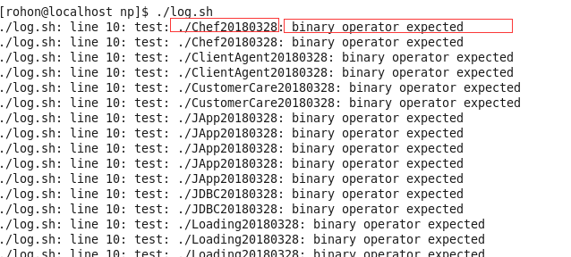

# linux 日志文件Shell工具

为了避免服务器因日志文件太多，导致硬盘无可用空间，于是就写了一个shell脚本，每日定时去查看日志文件的最后修改时间，如果最后修改时间已经过去1个月，就删除它。
在写shell脚本的时候有遇到一些问题，现在将其记录下来。

## 获取文件的最后修改时间

要获取文件信息需要使用到`stat`命令，关于`stat`的更多使用方法，可以参考[linux中的stat介绍](https://blog.csdn.net/paicmis/article/details/60479639)

具体命令如下：

```
a=`stat -c %Y $file`
```

代码的意思是获取文件的最后修改时间，以秒数返回

## 文件有空格，到时shell脚本报错

在遍历文件目录下所有日志文件，判断是否是文件时，会报错。在修改之前的代码如下

```
for file in ./*
    do
    if test -f $file
    then
        #echo "result is ===> $result"
        a=`stat -c %Y $file`
        b=`date +%s`
        #echo "a is $a,b is $b"
        if [ $[ $b - $a ] -gt 2592000 ];then
            echo "`date +%Y%m%d_%H%M%S` start to remove $1$file" >> $2
            rm -rf $file
        fi
    fi
done
```
在运行shell脚本后，会报以下错误



后来通过查资料得知，我的日志文件有空格符号，linux有一个保存着分割符号的变量，里面有tab,空格，换行等分割符，当shell脚本执行到具有空格文件字符串时，会将字符串通过空格符拆分，导致shell报错。于是将保存着分隔符的变量中的内容换成以换行为分割符。具体内容如下：

```
OLD_IFS=$IFS
    IFS=$'\n'
    cd $1
    for file in ./*
    do
        #result=$(echo $file | grep ".log")
        #if [[ "$result" != ""  ]]
        if test -f $file
        then
            #echo "result is ===> $result"
            a=`stat -c %Y $file`
            b=`date +%s`
            #echo "a is $a,b is $b"
            if [ $[ $b - $a ] -gt 2592000 ];then
                echo "`date +%Y%m%d_%H%M%S` start to remove $1$file" >> $2
                rm -rf $file
            fi
        fi
    done
IFS=$OLD_IFS
```

[IFS](https://www.cnblogs.com/fjping0606/p/4573536.html)就是分割符的缓存变量,在开始之前将其设置为`\n`换行分割符，在执行之后，恢复原始值。代码中的`$1`和`$2`代表`shell函数`的第一个参数和第二个参数。
完整的日志文件代码如下

```
#!/bin/bash
function logmanager(){
    OLD_IFS=$IFS
    IFS=$'\n'
    cd $1
    for file in ./*
    do
        #result=$(echo $file | grep ".log")
        #if [[ "$result" != ""  ]]
        if test -f $file
        then
            #echo "result is ===> $result"
            a=`stat -c %Y $file`
            b=`date +%s`
            #echo "a is $a,b is $b"
            if [ $[ $b - $a ] -gt 2592000 ];then
                echo "`date +%Y%m%d_%H%M%S` start to remove $1$file" >> $2
                rm -rf $file
            fi
        fi
    done
    IFS=$OLD_IFS
}

```

shell函数的使用方法如下

```
# params1为日志目录的绝对路径
# params2为log脚本打印的内容输出文件路径，可以使用相对或绝对路径
logmanager params1 params2
```