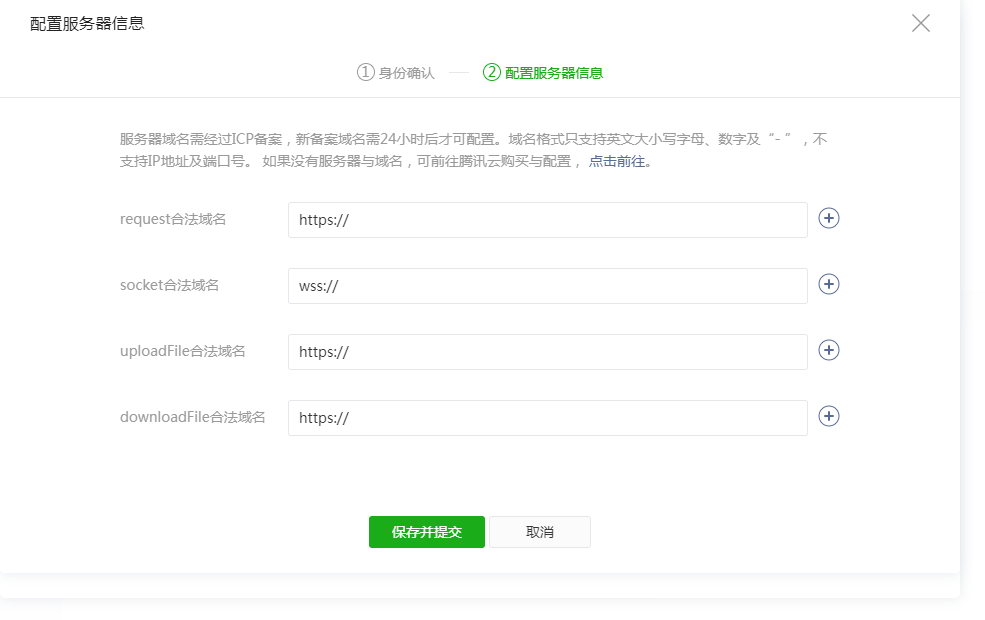
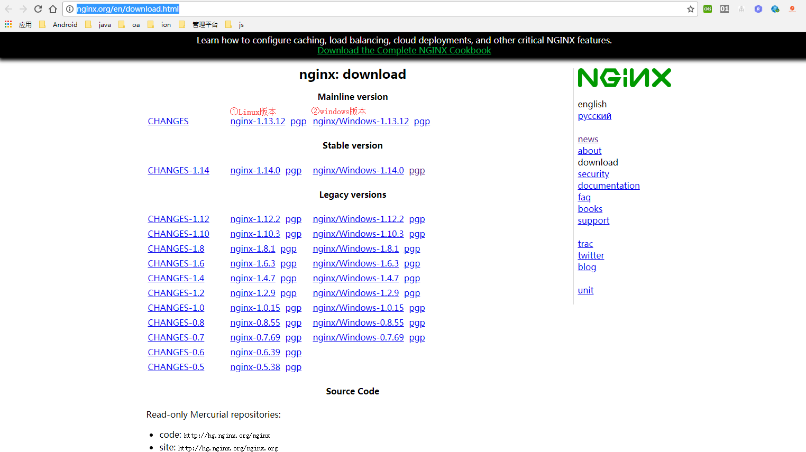
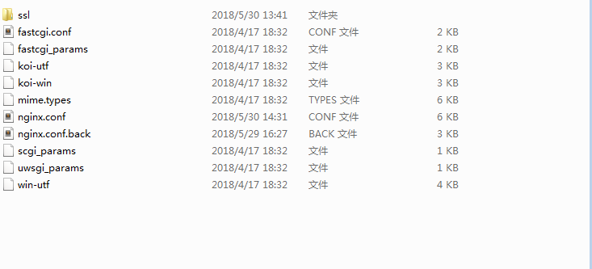
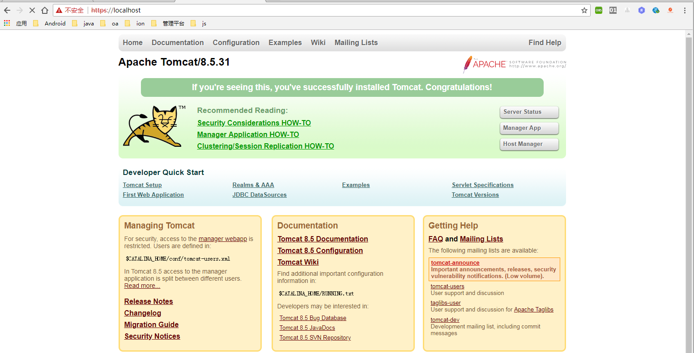
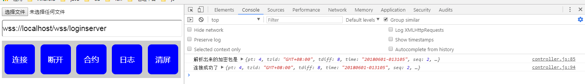

# nginx实现Https和wss代理

最近公司高层决定将公司一款产品(混合开发)移植到微信小程序上，由于项目采用混合开发，很容易实现有移动端转向web端。在公司小伙伴的辛苦工作下，很快就实现了移植微信小程序(开发模式),在准备发布的时候，发现微信小程序只接受https和wss协议的服务器地址。唠，就下面这货



在公司人员紧缺的情况下，boss可不愿意再花更多的代价去修改服务器，所以项目主管决定采用nginx服务器代理https和wss。毕竟大佬还是大佬，需求提出，但是实现还得我们这些小弟去实现。在接到需求的时候，我内心是拒绝的，但是身为程序员，怎么能拒绝苦难呢，只能迎难而上，恩，是的，当时我就是这么想的!

在接到需求之后，先来一波理性分析，首先我们的项目是打包成静态网页放在服务器上面，然后使用微信小程序的`web-view`加载服务器上的静态网页，这个静态网页的地址我们需要通过nginx代理为https地址。在一波分析之后，就开始动手`nginx`的安装和配置了,就在我准备开干的时候，老大找我聊天了，说你知道我们这次代理是正向代理还是方向代理呢？纳尼，做个功能还要知道这个，还有什么是正向代理和方向代理呢？在好奇心的驱使下，我打开了百度，输入了`正向代理百度百科`和`方向代理百度百科`，在孜孜不倦的学习下，我知道了正向代理和方向代理的定义。

> * 正向代理，意思是一个位于客户端和原始服务器(origin server)之间的服务器，为了从原始服务器取得内容，客户端向代理发送一个请求并指定目标(原始服务器)，然后代理向原始服务器转交请求并将获得的内容返回给客户端。客户端才能使用正向代理。
> * 反向代理（Reverse Proxy）方式是指以代理服务器来接受internet上的连接请求，然后将请求转发给内部网络上的服务器，并将从服务器上得到的结果返回给internet上请求连接的客户端，此时代理服务器对外就表现为一个反向代理服务器。


## Nginx安装

`Nginx`需要去[官网下载](http://nginx.org/en/download.html)



* linux版本下载的是源码，需要编译之后，才能安装，具体安装请见[linux nginx安装以及配置](https://blog.csdn.net/w410589502/article/details/70787468)
* windows版本直接就是绿色安装包，解压就能用

## openssl生成证书

证书我是通过linux生成，然后拷贝到windows下使用的，至于windows下如何使用openssl，请参考[
Windows安装使用Openssl](https://blog.csdn.net/kitok/article/details/72957185)

* 1.创建私钥

```shell
openssl genrsa -des3 -out buduhuisi.key 1024
```

期间会让你输入密码，请保护好密码，后面会使用到

* 2.创建csr证书

```shell
openssl req -new -key buduhuisi.key -out buduhuisi.csr
```

这里的buduhuisi.key就是上一步创建的秘钥,执行上述命令后，需要输入一系列的信息。输入的信息中最重要的为`Common Name`，这里输入的域名即为我们要使用https访问的域名 ，由于我这边是测试，就直接填写的`localhost`。

* 3.去除密码

复制buduhuisi.key并重命名为buduhuisi.key.org。

在命令行中执行如下命令以去除口令：

```
openssl rsa -in buduhuisi.key.org -out buduhuisi.key
```

这里需要输入密码，这个密码就是第一步创建秘钥时的密码

* 4.生成crt证书

```
openssl x509 -req -days 365 -in buduhuisi.csr -signkey buduhuisi.key -out buduhuisi.crt
```

到这里，我们的证书也就创建完成，我们需要用到的是其中的buduhuisi.crt和buduhuisi.key这两个文件。

## 修改nginx.conf文件



为了防止我们修改乱了`nginx.conf`文件，我们先备份一份`nginx.conf.back`;然后我们就开始动手修改`nginx.conf`文件

先在文件中找到`# HTTPS server`地方，打开默认的注释

```
# HTTPS server
    #
server {
    listen       443 ssl;
    server_name  localhost;

    ssl_certificate      cert.pem;
    ssl_certificate_key  cert.key;

    ssl_session_cache    shared:SSL:1m;
    ssl_session_timeout  5m;

    ssl_ciphers  HIGH:!aNULL:!MD5;
    ssl_prefer_server_ciphers  on;

    location / {
        root   html;
        index  index.html index.htm;
    }
}
```

`ssl_certificate` 指向的就是我们刚生成的证书`.crt`文件路径
`ssl_certificate_key` 指向刚生成的`.key`文件路径
`ssl_session_cache` session缓存时间
`ssl_session_timeout` 超时

修改后的server配置为

```
#web服务真实地址
upstream web{
    server 192.168.1.57:8080;
}
server {
        listen       443 ssl;
        server_name  localhost;#此处localhost可写为域名

        ssl_certificate      D://devTools/nginx/nginx-1.14.0/conf/ssl/buduhuisi.crt;
        ssl_certificate_key  D://devTools/nginx/nginx-1.14.0/conf/ssl/buduhuisi.key;

        ssl_session_timeout 5m;
        ssl_protocols TLSv1 TLSv1.1 TLSv1.2; #按照这个协议配置
        ssl_ciphers  ECDHE-RSA-AES128-GCM-SHA256:HIGH:!aNULL:!MD5:!RC4:!DHE;#加密放肆
        ssl_prefer_server_ciphers  on;#加密
    
    
        location / {
            proxy_pass http://web;#代理的web服务
        }
    }
```

在上述配置完成之后，我们就可以校验https是否可用了



好了，在测试https可以访问代理服务器之后，我让同事使用https地址再测试一下，在我以为会一切很顺利的时候，同事告知我，连接不上WebSocket服务，纳尼，什么个情况，同事直接发了一个截图给我


从错误日志可以看出，普通的`WebSocket`连接（`ws://`这样的地址）是不能再https加载中的网页上初始化，麻蛋，居然还有这样的坑，以为只需要搞定https就行了，结果还需要配置`wss`。只有再继续搞定`wss`配置才能交代了。在我努力的寻找下，终于找到了我想要的解决方案

## WSS 配置

首先我们现在配置文件中添加一下我们需要代理的WebSocket服务地址

```
#appServer
upstream websocket_appserver{
    #websocket后台实际地址
    server 192.168.1.57:19837;
}
```

接着再在刚才配置`https`的`server`内容中添加上代理配置

```
location /wss/loginserver {
    access_log D://devTools/nginx/nginx-1.14.0/logs/come-websocket-loginserver.log;
    proxy_pass http://websocket/; #代理到上面的地址去
    proxy_read_timeout 60s;
    proxy_set_header Host $host;
    proxy_set_header X-Real_IP $remote_addr;
    proxy_set_header X-Forwarded-for $remote_addr;
    proxy_http_version 1.1;#WebSocket协议中握手请求的http版本
    proxy_set_header Upgrade $http_upgrade;#webSocket握手请求请求头
    proxy_set_header Connection 'Upgrade';#webSocket握手请求请求头
}
```

在配置了上述内容了，就可以验证一下配置是否正确了，这次我没有再让我的小伙伴测试了，我必须先保证我的白盒测试是ok的，不然又会返工。于是我使用`js`写了一个建议的`WebSocket`Demo，



到这里Nginx的配置也就ok

## 参考

* [Nginx配置文件详解](https://www.cnblogs.com/hunttown/p/5759959.html)
* [Nginx配置https和wss](https://www.cnblogs.com/weiyinfu/p/7389744.html)